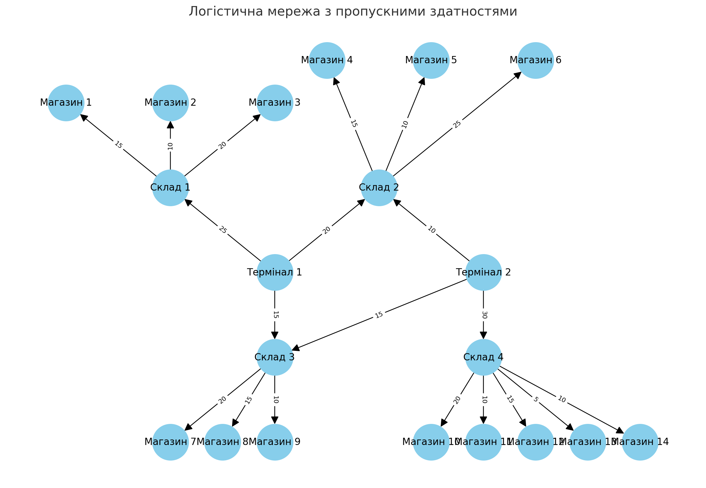

# Звіт: застосування алгоритму Едмондса–Карпа до логістичної мережі

## 1. Завдання

Потрібно побудувати орієнтований граф «термінали → склади → магазини» згідно з таблицею пропускних здатностей і **знайти максимальний потік** через мережу методом **Едмондса–Карпа (BFS + Форда–Фалкерсона)**.  
Далі провести аналіз та пояснити кроки алгоритму.

---

## 2. Модель графа

- **Вершини (20):**
  - 2 термінали (джерела товару): Термінал 1, Термінал 2
  - 4 склади (проміжні вузли): Склад 1–4
  - 14 магазинів (споживачі): Магазин 1–14
- **Ребра:**
  - Термінали → Склади
  - Склади → Магазини  
    Кожне ребро має пропускну здатність (макс. кількість одиниць товару).
- Для правильної роботи алгоритму додано технічні вершини:  
  Джерело → Термінали, Магазини → Сток.

---

## 3. Таблиця потоків між терміналами та магазинами

У таблиці наведено підсумкові значення потоків між терміналами та магазинами, що були обчислені за допомогою алгоритму Едмондса–Карпа.  
Дані для кожного термінала і магазину відображають обсяг товару, який фактично було доставлено.

| Термінал   | Магазин    | Фактичний Потік (од.) |
| ---------- | ---------- | --------------------- |
| Термінал 1 | Магазин 1  | 15                    |
| Термінал 1 | Магазин 2  | 10                    |
| Термінал 1 | Магазин 3  | 0                     |
| Термінал 1 | Магазин 4  | 15                    |
| Термінал 1 | Магазин 5  | 5                     |
| Термінал 1 | Магазин 6  | 0                     |
| Термінал 1 | Магазин 7  | 15                    |
| Термінал 1 | Магазин 8  | 0                     |
| Термінал 1 | Магазин 9  | 0                     |
| Термінал 1 | Магазин 10 | 0                     |
| Термінал 1 | Магазин 11 | 0                     |
| Термінал 1 | Магазин 12 | 0                     |
| Термінал 1 | Магазин 13 | 0                     |
| Термінал 1 | Магазин 14 | 0                     |
| Термінал 2 | Магазин 1  | 0                     |
| Термінал 2 | Магазин 2  | 0                     |
| Термінал 2 | Магазин 3  | 0                     |
| Термінал 2 | Магазин 4  | 0                     |
| Термінал 2 | Магазин 5  | 5                     |
| Термінал 2 | Магазин 6  | 5                     |
| Термінал 2 | Магазин 7  | 5                     |
| Термінал 2 | Магазин 8  | 10                    |
| Термінал 2 | Магазин 9  | 0                     |
| Термінал 2 | Магазин 10 | 20                    |
| Термінал 2 | Магазин 11 | 10                    |
| Термінал 2 | Магазин 12 | 0                     |
| Термінал 2 | Магазин 13 | 0                     |
| Термінал 2 | Магазин 14 | 0                     |

---

## 4. Алгоритм

1. **BFS** знаходить збільшуючий шлях (augmenting path).
2. Обчислюється вузьке місце (мінімальна пропускна здатність уздовж шляху).
3. Потік збільшується на цю величину.
4. Кроки повторюються, доки шляхи ще існують.

### Пояснення логіки кожного кроку (bottleneck)

На кожному кроці BFS знаходить шлях, а Δ дорівнює мінімальній залишковій місткості (вузькому місцю) на цьому шляху:

1. Джерело → Т1 → С1 → М1 → Сток, Δ=15
2. Джерело → Т1 → С1 → М2 → Сток, Δ=10
3. Джерело → Т1 → С2 → М4 → Сток, Δ=15
4. Джерело → Т1 → С2 → М5 → Сток, Δ=5
5. Джерело → Т1 → С3 → М7 → Сток, Δ=15
6. Джерело → Т2 → С2 → М5 → Сток, Δ=5
7. Джерело → Т2 → С2 → М6 → Сток, Δ=5
8. Джерело → Т2 → С3 → М7 → Сток, Δ=5
9. Джерело → Т2 → С3 → М8 → Сток, Δ=10
10. Джерело → Т2 → С4 → М10 → Сток, Δ=20
11. Джерело → Т2 → С4 → М11 → Сток, Δ=10

**Сума Δ = 115** → потік оптимальний.

---

## 5. Покрокові результати

Кожен шлях: **Джерело → Термінал → Склад → Магазин → Сток**.

**Сумарний потік = 115 одиниць.**

---

## 6. Результати

- **Максимальний потік = 115** одиниць.
- **Мін-розріз = 115**: всі канали від терміналів до складів насичені.
- **Розподіл терміналів:**
  - Термінал 1 → 60
  - Термінал 2 → 55
- **Магазини і постачання:**  
  М1=15, М2=10, М4=15, М5=10, М6=5, М7=20, М8=10, М10=20, М11=10.  
  Магазини М3, М9, М12, М13, М14 отримали 0.

---

## 7. Вузькі місця

- Усі канали **Термінали → Склади** (25, 20, 15, 10, 15, 30) працюють на повну потужність.
- Насичені також ребра: С1→М1, С1→М2, С2→М4, С2→М5, С3→М7, С4→М10, С4→М11.

---

## 8. Висновки

1. **Які термінали забезпечують найбільший потік товарів до магазинів?**  
   Термінал 1 = 60 і Термінал 2 = 55 — обидва працюють на межі своїх каналів.

2. **Які маршрути мають найменшу пропускну здатність і як це впливає на загальний потік?**  
   Найменші — Склад 4 → Магазин 13 = 5, Склад 2 → Магазин 5 = 10, Склад 4 → Магазин 11 = 10.  
   Вони швидко насичуються і обмежують постачання до цих магазинів.

3. **Які магазини отримали найменше товарів і чи можна збільшити їх постачання?**  
   Магазини 3, 9, 12, 13, 14 отримали **0**, а Магазини 5, 6 — мінімальні обсяги.  
   Збільшити їх постачання можна лише після розширення каналів **Термінали → Склади**, бо саме вони визначають загальний максимум (115 од.).

4. **Чи є вузькі місця, які можна усунути для покращення ефективності мережі?**  
   Так — це насичені канали між **терміналами та складами**. Без їх розширення загальний потік не зросте, навіть якщо склади мають вільні виходи до магазинів.

